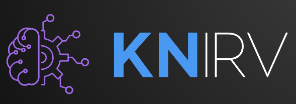

# KNIRVCHAIN

<p align="center">
  
</p>

## Run a node

```bash

chmod +x run.bash

./run.bash

-----------------------------
The Technical Documentation:
-------------------------------
Blockchain Design

KNIRV:
Key Notarized Immutable Repository of Vectors
A cloud based blockchain application that can perform the following features:
Mints and manages fungible NRN tokens.
Compiles smart contracts in golang.
Verifies Blockchain ownership via wallet signature.
Spawns and connects Locker Hosts with Opteq Wallets.

How it works:
There is only one KNIRVCHAIN owner that can spawn any number of peer chains for backup and security purposes. All KNIRVCHAIN peers can spawn Locker Host Clients. Users will visit the KNIRVCHAIN cloud application to download and install their Opteq Wallet. During an installation process the KNIRVCHAIN will generate, compile, and deploy the customized desktop clients we call the Locker that is linked to the user’s Opteq Wallet via secret key parameters.

The Locker Host Client utilizes the smart contracts as tools for both full index persistent private memory for ai agents via memory backup, as well as the engine for minting vectorized data as NFTs.
------------------------------------------
**Vault:**
A KNIRV chain owner’s server side wallet. Can link with the owner's mobile wallet for instant NRN transfer and owner ID verification purposes.
------------------------------------------
NRN Manager - User interface exclusively for the root chain owner to set cash payment parameters for the sale of NRN.
------------------------------------------
Token Design

NRN:
Notarized Royalty Number
*Pronounced Neuron or New Run*
A go smart contract token initially minted by the KNIRVCHAIN for use as a fungible token throughout the network of Locker Hosts as a (wrapper or gas fee) to mint new NFTs. NRN tokens are minted on the KNIRV Root chain only. These tokens are sold to Locker Hosts (KNIRVCHAIN client users).
------------------------------------------
NFT:
The NFT USDZ object can hold all data required to render digital 3D content. The new NFT Serves as a Dynamic DNS service for each underlying object directly. NFT token identifiers dynamically linked to private USDZ files. Once linked, unique versions and metrics can be tracked with metadata. These NFTs can also hold NRN tokens as an exposure royalty for viewing an asset held in a Locker.
-----------------------------------------
Smart Contract:
The Locker Host Client utilizes the smart contracts as tools for both full index persistent private memory for ai agents via memory backup, as well as the engine for minting vectorized data as NFTs.

*====================================*
Consume the KNIRVCHAIN Codebase Repo here:
https://github.com/Inc-liner/KNIRVchain-master/tree/main
*====================================*

Note: The code base was recently merged from two different implementations. Much of the code in the "knirv" and "install" directories do not work or has not been implemented in the rest of the build as they should. Please apply attention to getting the knirv module integrated AFTER we've fixed all known errors and have confirmed the basic blockchain capabilities are in working order. Also, keep in mind that this golang application is utilizing three different modules:

KNIRVCHAIN (main module)
chain (all blockchain functionality. The blockchain database via leveldb is located here as well)
knirv (all custom application functionality)

PS Note: We are developing the "Opteq Wallet" elsewhere. The Opteq Wallet development is not included your scope...
```
# KNIRVCHAIN
